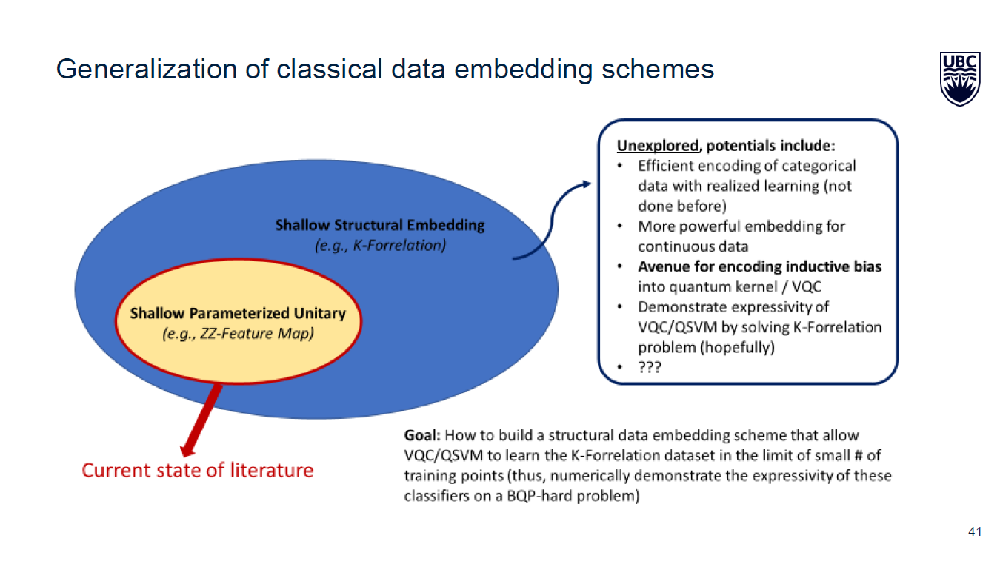

# Structural Encoding Policy for Quantum Classifiers

This is currently a work in progress.

The research direction is inspired from [my research on the k-Forrelation dataset](https://github.com/marklong-pg/k-forrelation-dataset). In particular, this idea is inspired by the observation that when quantum circuits that describe k-Forrelation instances are used as the encoding strategy for Variational Quantum Classifer and Quantum Support Vector Machine, these classifers can solve the k-Forrelation problem.

Could there be other complex problems in which quantum classifiers can benefit from an encoding policy that involves dynamically changing the structure of the encoding layer depending on each example? 

Also, could this allow a more natural way to encode categorical data into quantum circuits?

